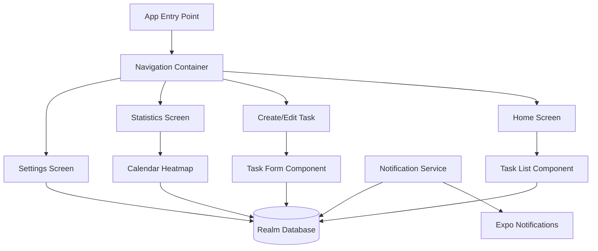

# One Percent Better App - Implementation Plan

## Overview

A React Expo mobile app for managing daily task reminders and single events with notifications, snooze/skip/completion tracking, and visual consistency analytics using a calendar heatmap.

## Technology Stack

- **Framework**: React Native with Expo (latest version as of 1/16/2026)
- **Storage**: Realm Database
- **Notifications**: Expo Notifications API
- **Charts**: react-native-calendars or similar for heatmap visualization
- **Navigation**: React Navigation (Stack/Tab navigator)
- **Date Handling**: date-fns or dayjs

## Architecture Overview



## Data Model (Realm Schema)

### Task Schema

- `_id`: ObjectId (primary key)
- `title`: string (required)
- `description`: string (optional)
- `action`: string (required) - "Take vitamins", "Practice mindfulness", etc.
- `type`: string - "daily" | "weekly" | "single"
- `time`: string (HH:mm format)
- `daysOfWeek`: int[] (0-6, Sunday-Saturday) - for weekly tasks
- `date`: Date - for single events
- `isActive`: boolean
- `createdAt`: Date
- `updatedAt`: Date

### TaskCompletion Schema

- `_id`: ObjectId
- `taskId`: ObjectId (reference to Task)
- `date`: Date (completion date)
- `status`: string - "completed" | "skipped" | "snoozed"
- `snoozeMinutes`: int (if snoozed)
- `completedAt`: Date

### Settings Schema

- `_id`: ObjectId
- `defaultSnoozeMinutes`: int (default: 10)
- `notificationsEnabled`: boolean

## Implementation Todos

### 1. Project Setup (`todo_setup.md`)

- Initialize Expo project with TypeScript template
- Install dependencies: Realm, Expo Notifications, React Navigation, date-fns, react-native-calendars
- Configure app.json for notification permissions
- Set up folder structure (screens, components, services, models, utils)
- Configure Realm database initialization
- Set up TypeScript configuration

### 2. Data Models & Realm Schema (`todo_data_models.md`)

- Create Realm schemas for Task, TaskCompletion, Settings
- Implement Realm service/context for database operations
- Create TypeScript interfaces/types for all models
- Implement CRUD operations for tasks
- Implement completion tracking functions
- Seed default settings (10 min snooze)

### 3. Navigation Structure (`todo_navigation.md`)

- Set up React Navigation (Stack Navigator)
- Create navigation structure: Home, Create/Edit Task, Statistics, Settings
- Implement navigation types
- Add bottom tab navigator or drawer if needed
- Create header components with appropriate actions

### 4. Task Creation & Editing (`todo_task_creation.md`)

- Build TaskForm component with:
  - Title input
  - Description textarea
  - Action text input
  - Type selector (daily/weekly/single)
  - Time picker
  - Days of week selector (for weekly tasks)
  - Date picker (for single events)
- Form validation
- Save/update functionality
- Delete task option
- Toggle active/inactive

### 5. Home Screen & Task List (`todo_home_screen.md`)

- Display list of active tasks
- Show upcoming tasks for today
- Task card component with:
  - Title, description, action
  - Time display
  - Quick actions (Complete, Skip, Snooze)
- Snooze modal with time picker (default 10 min, customizable)
- Filter by type (daily/weekly/single)
- Empty state when no tasks

### 6. Notification System (`todo_notifications.md`)

- Request notification permissions on app start
- Schedule notifications for tasks:
  - Daily tasks: schedule for selected time each day
  - Weekly tasks: schedule for selected days at selected time
  - Single events: schedule for specific date/time
- Handle notification interactions:
  - Tap notification → open app to task
  - Action buttons: Complete, Skip, Snooze
- Implement notification cancellation when task is deleted/completed
- Handle app state changes (foreground/background)
- Reschedule notifications when task is edited

### 7. Statistics & Calendar Heatmap (`todo_statistics.md`)

- Create Statistics screen
- Fetch completion data from Realm
- Implement calendar heatmap component:
  - Color intensity based on completion rate
  - Show completion streaks
  - Display daily completion counts
- Calculate and display:
  - Overall completion rate
  - Current streak
  - Longest streak
  - Total tasks completed
- Filter by task type or date range

### 8. Settings Screen (`todo_settings.md`)

- Default snooze time setting (minutes picker)
- Notification preferences toggle
- App information section
- Clear all data option (with confirmation)
- Export/import data (optional enhancement)

### 9. Polish & Testing (`todo_polish.md`)

- Add loading states
- Error handling and user feedback
- Smooth animations and transitions
- Test notification scheduling
- Test on iOS and Android
- Handle edge cases (timezone changes, device restart)
- Optimize Realm queries for performance

## File Structure

```
my-scheduler/
├── app.json
├── package.json
├── tsconfig.json
├── App.tsx
├── src/
│   ├── models/
│   │   ├─oo─ Task.ts
│   │   ├── TaskCompletion.ts
│   │   └── Settings.ts
│   ├── services/
│   │   ├── realm.ts
│   │   ├── notifications.ts
│   │   └── statistics.ts
│   ├── screens/
│   │   ├── HomeScreen.tsx
│   │   ├── CreateTaskScreen.tsx
│   │   ├── StatisticsScreen.tsx
│   │   └── SettingsScreen.tsx
│   ├── components/
│   │   ├── TaskCard.tsx
│   │   ├── TaskForm.tsx
│   │   ├── CalendarHeatmap.tsx
│   │   ├── SnoozeModal.tsx
│   │   └── TimePicker.tsx
│   ├── navigation/
│   │   └── AppNavigator.tsx
│   └── utils/
│       ├── dateUtils.ts
│       └── constants.ts
└── todo_*.md files
```

## Key Implementation Notes

1. **Notifications**: Use Expo's `scheduleNotificationAsync` with unique identifiers tied to task IDs. Handle timezone considerations.

2. **Realm**: Initialize Realm with schemas on app start. Use Realm React hooks for reactive updates.

3. **Calendar Heatmap**: Use a library like `react-native-calendars` or build custom component using SVG. Color intensity should reflect completion percentage.

4. **Snooze Logic**: When user snoozes, reschedule notification for X minutes later and record in TaskCompletion with status "snoozed".

5. **Completion Tracking**: Record every interaction (completed, skipped, snoozed) in TaskCompletion table with timestamp for accurate statistics.

6. **Date Handling**: Store dates in UTC, display in user's local timezone. Handle day-of-week calculations correctly.

## Dependencies to Install

- `expo` (latest)
- `react-native-realm`
- `expo-notifications`
- `@react-navigation/native` + `@react-navigation/stack`
- `react-native-screens`
- `react-native-safe-area-context`
- `date-fns`
- `react-native-calendars` (or alternative for heatmap)
- `@react-native-community/datetimepicker` (for time/date pickers)

## Next Steps

Work through each `todo_*.md` file sequentially, starting with `todo_setup.md` for project initialization.

## Future Features (Pro Plus / AI)

### Post Task Notes

**Feature Overview**: Allow Pro Plus users to add feedback and notes after completing tasks. This data feeds into the AI personalization system to improve the user experience.

**Implementation Plan**:

1. **Data Model Extensions**:
   - Extend `TaskCompletion` schema to include:
     - `notes`: string (optional) - free-form text notes
     - `difficultyRating`: int (1-5) - difficulty level
     - `challengeRating`: int (1-5) - challenge level
     - `moodRating`: int (1-5) - mood level (1=Sad, 2=Bored, 3=Ok, 4=Happy, 5=Very Happy)
     - `additionalMetrics`: object (flexible for future expansion)

2. **UI Components**:
   - Create `PostTaskNotesModal` component
   - Text input for free-form notes
   - Radio button groups for:
     - Difficulty (5 options: Very Easy → Very Hard)
     - Challenge (5 options: Not Challenging → Extremely Challenging)
   - Icon-based mood selector with 5 mood options:
     - 😢 Sad
     - 😐 Bored
     - 😐 Ok
     - 😊 Happy
     - 😄 Very Happy
   - Optional: Quick reaction buttons (emoji-based)
   - Save/Cancel actions

3. **Integration Points**:
   - Show notes modal after task completion (optional, can be dismissed)
   - Add "Add Notes" button to completed task history
   - Display notes in task completion details view

4. **AI Personalization Integration**:
   - Aggregate notes data for pattern analysis
   - Feed into difficulty tuning algorithm
   - Inform content personalization
   - Optimize notification timing based on completion patterns
   - Use mood data for mood-based task suggestions and timing
   - Detect burnout/fatigue patterns (low mood + high difficulty correlation)

5. **Privacy & Storage**:
   - Store notes locally in Realm (privacy-first)
   - Sync via encrypted cloud (Pro Plus managed cloud)
   - Allow users to view/edit notes history
   - Export notes for personal reflection (future)

**Design Considerations**:
- Keep notes optional - don't force users to add notes
- Make it quick and easy (30 seconds or less)
- Use clear, intuitive labels for rating scales
- Consider voice-to-text input for notes (future)
- Show pattern insights visualization (trends over time)

**Technical Notes**:
- Notes are associated with specific task completions
- Can query notes by task, date range, or rating
- AI processing can happen on-device or via encrypted cloud sync
- Consider adding analytics to track note completion rates
