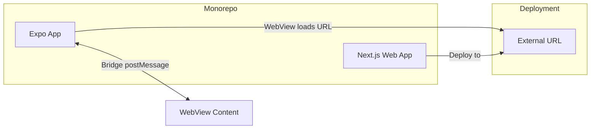

# Expo + Next.js WebView Monorepo Template

Monorepo template for an **Expo React Native app** that displays a **Next.js web app** in a WebView via an **external URL**, with a documented **bridge** for bidirectional communication.

## Architecture



- **Expo app**: Runs on device/simulator; contains a WebView that loads the **external URL** where the Next.js app is deployed. Requires network access.
- **Next.js app**: Developed in this monorepo but **deployed elsewhere** (Vercel, custom host, etc.). The Expo app does not bundle it; it fetches it over the internet.
- **Bridge**: Bidirectional messaging between React Native and the page inside the WebView (the same Next.js app when loaded from that URL).

## Repo structure

| Path                    | Description                                            |
| ----------------------- | ------------------------------------------------------ |
| `apps/expo-app`         | Expo (React Native) app with WebView and bridge        |
| `apps/next-web`         | Next.js 16 web app (App Router, Tailwind CSS v4), deployed to external URL |
| `packages/bridge-types` | Shared TypeScript types for bridge messages            |

## Prerequisites

- **Node.js** 20.19.4+ (required for Expo SDK 56; Next.js 16 needs 20.9+)
- **pnpm** 9+ via Corepack (`corepack enable` then `corepack prepare pnpm@9.15.0 --activate`)
- **EAS** (recommended for Expo SDK 56 builds; Expo Go may not be available for the latest SDK on app stores)
- iOS/Android setup for running the Expo app (simulator or device)

**Note:** If `npx expo install --fix` fails with `unknown option --fix`, uninstall the legacy global CLI (`npm uninstall -g expo-cli`) and use the local CLI: `pnpm --filter expo-app exec expo install --fix`.

## External URL and internet

- The Next.js app is **deployed to an external URL**. The Expo app does not serve it; it only loads that URL in the WebView.
- The Expo app **requires network access** to load the URL. This is the default in Expo; no extra permission is needed for HTTPS.
- Set the WebView URL via **`EXPO_PUBLIC_WEBVIEW_URL`** in a `.env` file at the repo root or in `apps/expo-app`, or in app config. Replace the placeholder (`https://your-next-app.vercel.app`) with your deployed URL before running the Expo app.

## Bridge

Bidirectional communication between React Native and the web app inside the WebView:

- **Message format**: `{ type: string, payload?: object }`. Example types: `HELLO`, `HELLO_REPLY`, `NAVIGATE`.
- **Web → RN**: The web app calls `window.ReactNativeWebView.postMessage(JSON.stringify(message))`. React Native receives the string in `event.nativeEvent.data`, parses JSON, and handles by `type`.
- **RN → Web**: React Native calls `injectJavaScript` with a script that dispatches `CustomEvent('rn-message', { detail: payload })`. The web app listens with `window.addEventListener('rn-message', handler)` (only when `ReactNativeWebView` is present).

See the [Bridge](#bridge) section above and the code in `apps/expo-app/lib/bridge.ts` and `apps/next-web/hooks/useBridge.ts` for the exact contract.

## Getting started

1. **Clone** the repo and install at root:

   ```bash
   pnpm install
   ```

2. **Next.js** (web app):
   - Run locally: `pnpm dev:next` (or `pnpm --filter next-web dev`).
   - Build and deploy to your host (e.g. Vercel). Set the deployed URL as `EXPO_PUBLIC_WEBVIEW_URL` (see [External URL and internet](#external-url-and-internet)).

3. **Expo** (mobile app, SDK 56):
   - Copy `.env.example` to `.env` and set `EXPO_PUBLIC_WEBVIEW_URL` to your deployed Next.js URL.
   - After install, align native module versions if needed: `pnpm --filter expo-app exec expo install --fix`
   - Run: `pnpm dev:expo` (or `pnpm --filter expo-app start`). Open on a device or simulator and confirm the WebView loads the external URL and that the bridge works (e.g. tap "Send HELLO to React Native" in the web app and see the reply).

**Stack versions (template baseline):** Expo SDK 56, React Native 0.85, React 19.2, Next.js 16.2, Tailwind CSS 4.

## Deployment

- **Next.js**: Deploy `apps/next-web` to Vercel, Netlify, or any Node/static host. Use the resulting URL as `EXPO_PUBLIC_WEBVIEW_URL`.
- **Expo**: Use [EAS Build](https://docs.expo.dev/build/introduction/) to build the native app; ensure `EXPO_PUBLIC_WEBVIEW_URL` is set in your build environment.

## Security

- Use **HTTPS** for the external URL. The template uses `originWhitelist: ['https://*']`; restrict to your domain(s) if desired.
- The web app can validate the source of messages (e.g. only handle known `type`s and shapes) and avoid trusting arbitrary payloads from the WebView.

## Template disclaimer

This repo is a **structural and documentation template**, not a one-click generator. Use it by cloning or clicking **Use this template** on GitHub, then:

- Replace placeholders (e.g. `EXPO_PUBLIC_WEBVIEW_URL`, app names, bundle IDs).
- Add your own features and deploy the Next.js app to your chosen URL.

For how to set this repo up as a **GitHub template** and create new repos from it, see [howto_template.md](howto_template.md).
